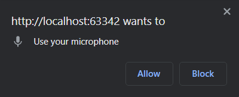
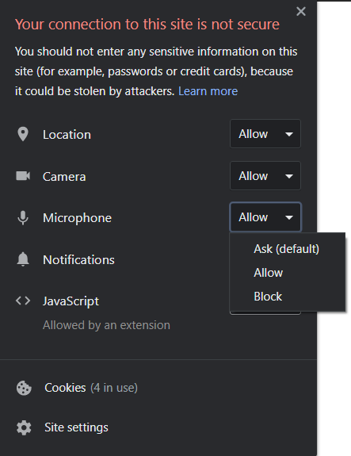

# microphone-sample
A sample project to explore the microphone feature.

### API(s)
+ MediaStream Recording

### Instructions
+ Click the record button to start recording some audio.
+ If it is your first time running this example, you are asked to grant/deny the microphone permission to the
 browser.
    
+ If you click `Allow`, the audio recording will start.
+ If you click `Block`, an error alert will pop up.
+ You can still make the microphone permission popup appear by clicking on the Info button near the page URL and
 setting that permission properly. To apply the update, reload the page.
    
+ When you are done with the recording, click the stop button. You can hear your recording, download it or recorder
 another audio.

### Notes
+ The project has been tested on
    + Google Chrome 87 (both Desktop and mobile)
    + Mozilla Firefox 83 (both Desktop and mobile)

### Documentation and useful resources
+ [MediaStream Recording API](https://developer.mozilla.org/en-US/docs/Web/API/MediaStream_Recording_API)
+ [Using the MediaStream Recording API](https://developer.mozilla.org/en-US/docs/Web/API/MediaStream_Recording_API/Using_the_MediaStream_Recording_API)
    + [Live demo](https://mdn.github.io/web-dictaphone/)
    + [Source code](https://github.com/mdn/web-dictaphone/)
